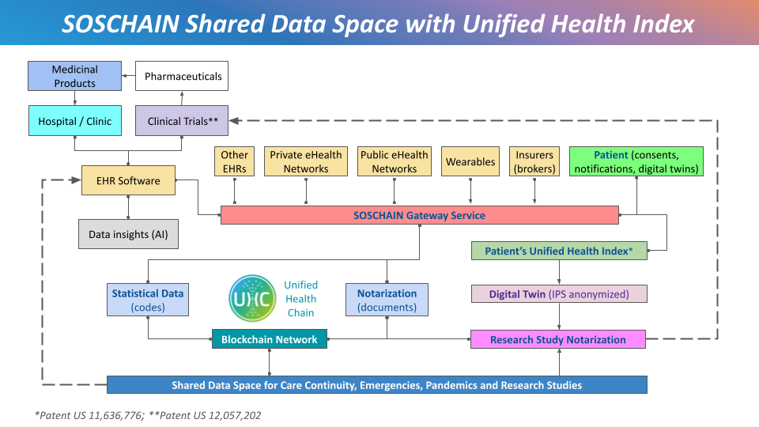
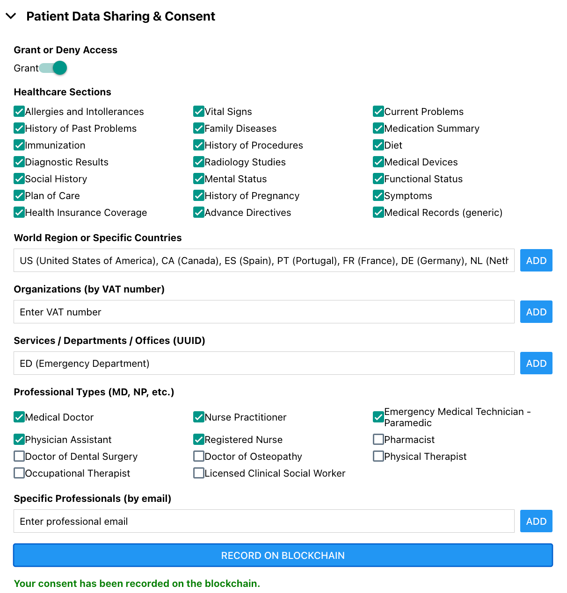

# SOSCHAIN Shared Data Space for Unified Health Index (UHI) in Emergencies, Pandemics, Care Continuity, and Research Studies

Copyright (c) 2024 Fernando Latorre López, CTO at [ConnectHealth](https://connecthealth.info).

## Introduction
*(Watch the preview video at [Youtube.com/@soschain](https://youtube.com/@soschain))*

SOSCHAIN is a collaborative shared data space designed to enhance data accessibility and security through the use of a ***Unified Health ID for patients***, operating on the patented *Unified Identification Protocol for Training and Health* and based on the Unified Health Chain (UHC), BloodChain and Don@te projects. It ***enables the implementation of a Unified Health Index (UHI)***, which is especially crucial during emergencies and catastrophic events.

The **Unified Health Index (UHI) serves as a table of contents** (links to data providers worldwide), allowing patients or practitioners to construct a **unified international patient summary (Unified IPS)** by retrieving distinct sections and clinical documents from decentralized portals of healthcare and insurance providers globally, using decentralized identity documents (W3C specification) and healthcare standards (HL7 FHIR). This approach enables patients **to maintain an automatically updated Unified Health Index, regardless of digital literacy or disabilities, thereby enhancing patient safety, especially in emergencies**.

The **SOSCHAIN Shared Data Space leverages the Unified Health Index (UHI)** to provide secure, interoperable access to a patient’s data index and records stored across different healthcare providers internationally. By using international standards and blockchain-certified consents, the system enables patients to construct an International Patient Summary (IPS) from their UHI. The consent contains the URL address of the SOSCHAIN Gateway Service selected by patients to mantain their data index, and the permissions granted to distinct organizations, practitioners and research studies.

## Addressing Critical Challenges

The Unified Health ID addresses a critical issue: the lack of a unique, unified patient ID that links health data across systems and regions. With SOSCHAIN practitioners will be able to request and obtain access to read records created and maintained in other healthcare systems (EHR) or patient portals across borders through the patient’s UHI and registered consents. This enhances response in emergencies and care continuity, reduces inefficiencies, data fragmentation, administrative costs, misdiagnoses, medical errors, complications, and readmissions, and supports a more holistic approach to healthcare delivery.

Public and private healthcare services can now ensure that each patient has a unique, unified identifier that consolidates their entire medical history. This enables seamless data sharing within a territory and even internationally when patients travel. This is particularly beneficial in emergencies or when patients need care abroad, as authorized providers can securely access their health records across borders.

Additionally, patients can receive communications during emergencies and disasters and request services from civil protection agencies by sharing their Unified Health ID, location, and additional information, such as the type of emergency, severity (triage), number of people affected, and other identifiers. This is particularly useful when phone lines are overwhelmed.

In catastrophic events, physical documents are often lost. SOSCHAIN’s goal is to provide people with secure, digital access to all essential data in standardized international formats, making it accessible and inclusive. This includes clinical records, insurance information, and critical documents like birth certificates, ensuring they are always available in digital form when needed.

## International Patient Summary (IPS) Vs. SMART Health Card (SHC)

The **[International Patient Summary](https://international-patient-summary.net/) ([ISO 27269](https://www.sls.se/globalassets/sls/sls/remissvar/remisser/2021/iso_27269_2021.pdf)) has been approved by the [G7](https://international-patient-summary.net/g7-countries-promote-ips/), the [EU](https://mhealth-hub.org/international-patient-summary), and other countries (e.g., [Australia](https://developer.digitalhealth.gov.au/standards/health-informatics-international-patient-summary), [Indonesia](https://govinsider.asia/intl-en/article/indonesia-uses-international-patient-summary-to-facilitate-pilgrims-medical-treatment), [New Zealand](https://international-patient-summary.net/new-zealand-patient-summary/)) for healthcare data exchange**. It is also **supported by Electronic Health Record (EHR) systems** (e.g. [Epic](https://www.pulseit.news/australian-digital-health/epic-to-implement-international-patient-summary-in-careeverywhere/), [OpenEHR](https://ckm.openehr.org/ckm/templates/1013.26.376)).

It supports the right to data portability and accessibility by structuring health records in a way that allows them to be understood and reused across different healthcare systems. When sharing patient data in a structured format or exporting a patient’s medical history for data portability, the IPS format includes a "Composition" document resource (the index) that categorizes each data record into clearly defined sections, such as allergies, medications, and immunizations. This structure not only organizes the data but also links each resource to a specific section within the patient’s index, ensuring that data can be appropriately categorized and interpreted by different providers or organizations.

In contrast, Smart Health Cards (SHCs) are not designed to serve this purpose. SHCs are optimized for compact data sharing (using minimized data rather than the original data) and do not include an index (Composition resource). They provide isolated pieces of health data without specifying their place within a patient’s summary or where to retrieve the original resources. This limits the SHC’s utility for comprehensive record export or full patient summary exchange.

## Unified Health Index (UHI) Vs. Smart Health Link (SHL)

Smart Health Link (SHL) is interoperable link mechanism to encapsulate and securely share FHIR resources,such as patient summaries, clinical observations, or medication lists.

The FHIR resource shared by a Smart Health Link (SHL) can be protected by a password, so anyone knowing the password can access the data without doing any login. Additionally, malware usually use fake links to infect user's devices.

By contrast, in the Unified Health Index (UHI), passwords are unnecessary due to DIDComm encryption. Since the IPS document in a message is already securely accessible only by the intended recipient’s digital identity (cryptographic keys), multiple passwords for each data shared are not required.

The Unified Health Index (UHI) approach enhances data portability by using the IPS document structure to link resources to specific sections, with data automatically encrypted and decrypted for the recipients. This supports improved data accessibility, portability, and continuity of care on a global scale.

## Sectors Related to the SOSCHAIN Shared Data Space

Entities across various sectors can certify identities and documents on the blockchain and send notifications to the SOSCHAIN Gateway Service (see next point), as authorized by individuals or their legal guardians (e.g., for children or dependents) via a signed consent in the Decentralized Identity Document for Healthcare. This enables them to receive notifications related to healthcare, insurance, and civil protection services. 

Different sectors can benefit from the SOSCHAIN Shared Data Space, providing advantages from various perspectives: the patient’s, the healthcare and social practitioners’, research, and public health. This multisectoral data ecosystem enhances the patient experience by simplifying their healthcare journey—from understanding insurance benefits to tracking the quality of products used in their treatments. This transparency empowers patients to make informed healthcare decisions and offers practitioners a holistic view of the patient’s medical and insurance information.

During blockchain certification, clinical codes are extracted for statistics and research, de-identified and supplemented with relevant details, such as year of birth, birth sex, and gender related to the code, to aid in statistical analysis. This is securely managed through private smart contracts on Hyperledger Fabric, ensuring that only permissions, hashes, and de-identified data are registered on the Unified Health Chain (UHC) blockchain network.

The sectors which can contribute to and benefit of SOSCHAIN are the following:

- **healthcare**:  Patients or their legal guardians can grant permissions to specific practitioner roles to access data across both public and private sectors in emergencies within specific territories and for continuity of care. This capability is especially critical for collaboration between public and private healthcare entities during pandemics and natural disasters. Additionally, hospitals, clinics, and blood banks can benefit from accessing statistical codes from various territories, extracted during blockchain certification, which may include optional details such as year of birth and gender related to clinical codes. This access will facilitate the development of AI tools that provide insights for effectively preparing for and responding to epidemics, pandemics, blood shortages, and other crises by utilizing data from their own territory as well as neighboring areas.

- **protection**: This includes civil protection services, rescue services (e.g., firefighters, lifeguards at beaches or swimming pools), and related support services. Individuals can receive notifications, such as weather alerts, risk warnings, and emergency evacuation plans from trusted sources (helping to prevent fake news and false alarms) via the authorized SOSCHAIN Gateway Service. Protection services may locate individuals through associated devices in emergencies and disasters (e.g., Bluetooth devices commonly used for item tracking). Additionally, professional roles registered on the blockchain will be able to access healthcare data authorized by consents registered on the blockchain, covering various healthcare providers. This data may include information about implanted pacemakers (e.g., when defibrillators cannot be used), essential medications (e.g., insulin), and allergies to medications like penicillin or materials like latex (important for intubation), among others. Individuals can also send **service requests** to protection services during emergencies, specifying emergency code, severity (triage), the number of affected individuals, and unified health IDs. This is critical when phone lines are saturated during natural disasters or catastrophes.

- **pharmacy**: Pharmacies (points of sale) and pharmaceutical companies (manufacturers) can certify the digital identities of their entities and staff. Patients or their legal guardians can share essential medical information with certified pharmacists and pharmacy assistants in emergencies, and pharmacies can contribute in crisis situations, such as administering vaccines during pandemics. Additionally, patients, healthcare practitioners, and pharmacy staff will be able to track biologically derived products that are implanted or recorded in a patient's unified health index (e.g., red blood cell bags, vaccines, and others), allowing them to monitor product quality over time and stay informed about any alerts related to these products, regardless of the territory where the patient is receiving care. This capability enables both patients and practitioners to promptly identify issues, such as recalls of compromised biologics or devices, and respond effectively to safety notifications.

- **research**: Certification of research studies conducted by clinical research organizations (CROs), universities, hospitals, pharmaceutical companies, and research laboratories (among others). Patients and legal guardians can search for studies and, with signed consent, submit International Patient Summary (IPS) documents or participate by sharing and updating anonymized digital twins (an anonymized IPS document) for research purposes. This capability is essential for developing and testing new treatments, especially during pandemics. Additionally, research organizations will benefit from statistical data registered on the blockchain, such as the number of events associated with specific codes occurring over a certain period, as well as the year of birth and gender related to the anonymized codes for statistical analysis..

- **government**: Public health organizations can access statistical codes from various territories, extracted during blockchain certification and including optional year of birth and gender related to the clinical codes. This data is essential for deriving insights and for effectively preparing for and responding to epidemics and pandemics.

- **insurance**: Insurers (brokers) and insurance companies can register insurance plans, coverages, and contracts, facilitating the verification of the trustworthiness of their offerings and helping to prevent fraud across various types of coverage (e.g., health, life, funeral). This is especially important for elderly individuals or those with disabilities, as well as in emergency or catastrophe scenarios, where it can enable automatic approvals for necessary treatments if a patient is unconscious, disoriented, lacks digital literacy, or has specific disabilities. This approach ensures prompt and effective medical responses while promoting inclusivity. Additionally, statistical data can be valuable for insurance and reinsurance companies, such as the number of events associated with specific codes occurring over a certain period, as well as the year of birth and gender related to the anonymized codes for statistical analysis.

- **travel**: Certified personnel, such as flight and train attendants, may access essential health data for individuals in emergencies during travel. This data may include information about implanted pacemakers (e.g., when a defibrillator cannot be used), required medications (e.g., insulin), and allergies to food, medications, and materials (e.g., latex), among others.

## Permissions

By default, the consent to activate the index for a patient in SOSCHAIN denies access to any of the patient's data to protect privacy. Exceptions can then be specified. The consent may include permissions for various services, such as:

- **Unified Health Index**: Consent to aggregate metadata, specifically the document URLs and the sections to which these documents pertain.
- **Patient Management**: Consent to read and store encrypted specific resources, such as appointments, encounters, coverage, and communications (e.g., messages from healthcare practitioners, insurance providers, research studies, or civil protection services).
- **Emergency Treatment**: Consent for emergency services practitioners (e.g., doctors, nurses, paramedics) to access the patient’s Unified Health Index, enabling access to patient data across multiple healthcare providers as authorized.
- - **Data for Statistics**: Consent to use de-identified healthcare information (e.g., country or region, clinical code, year of birth, birth sex, and gender) in an electronic record for statistical and research purposes. Re-identification of this information is prohibited under any circumstances.
- **Protection Services**: Consent for certain professionals in emergency situations to access specific sections of the Unified Health Index, allowing them to access relevant patient data across different healthcare providers as authorized.
- **Travel Services**: Consent for specific professionals in emergency situations to access certain sections of the Unified Health Index, allowing them to retrieve necessary patient data across healthcare providers as needed.

An example of data generated by the SOSCHAIN Gateway Service from the signed PDF document for the FHIR `Consent` resource is shown below:

## Unified Digital Identity in Healthcare for Cybersecurity

SOSCHAIN can integrate with major OpenID providers, such as Google, Apple, and European eID, to streamline patient and guardian registration and login to the SOSCHAIN Gateway Service. Official certificates (X509), verifiable credentials (such as those from the European Blockchain Services Infrastructure, EBSI), or other methods are used to verify identities, enhancing trust and security across the system.

Designed with security and resilience at its core, SOSCHAIN activates the UHI (Unified Health Index) for a patient upon receiving signed consent. At this point, the patient or their legal guardians receive a ***public unified health identifier*** along with a ***private registry code***.

The **private registry code** constitutes part of the `seed` used to generate the patient’s private cryptographic keys, which are post-quantum resistant. The remaining portion of the `seed` is securely stored by the SOSCHAIN Gateway Service chosen by the patient (consent). This setup ensures that the private cryptographic keys required for encrypted communications and data signing can only be reconstructed using the private code known solely to the patient or their guardians.

This design enables secure access to SOSCHAIN services via web or app. It mitigates risks even if the private code required to reconstruct the cryptographic keys is compromised, as the other part remains secure with the SOSCHAIN Gateway Service. Similarly, if a SOSCHAIN Gateway Service was compromised, attackers would be unable to decrypt communications to the patient or legal guardians, as the component held by the patient or guardians is also needed to reconstruct the private key.

These keys and data verification features will allow the patient and authorized individuals to:

1. **Sign data** for secure and trusted communications and documents.
2. **Decrypt data** sent specifically to the patient.
3. **Obtain a public certificate** resistant to post-quantum computing, signed by the SOSCHAIN Gateway Service and containing trusted information (name, surname, etc.).
4. **Obtain verifiable credentials** resistant to post-quantum computing and signed by the SOSCHAIN Gateway Service, including credentials for related individuals, such as a birth certificate for a mother, or a death certificate.

## Leveraging Decentralized Identity Documents (DID Documents) for Secure Health Data Management

The **Unified Identification Protocol for Training and Health** uses [**Decentralized Identity Documents (DID Documents)**](https://www.w3.org/TR/did-core/) to give patients control over their health data. This secure method is also used in the **European Blockchain Services Infrastructure (EBSI)**, which helps verify citizens' identities and credentials, such as national IDs, when they log into various online services.

With this protocol, each **DID Document for Healthcare** creates a **Unified Health ID** for every patient. This ID links to other identifiers like national IDs, passports, or health cards, but it does not store any personal information directly. Instead, it keeps **encrypted hashes of these identifiers**, ensuring that the patient's privacy and data security are protected.

A key feature of this system is that patients or their legal guardians can use their DID Document to activate the **SOSCHAIN gateway service**, which maintains the **Unified Health Index** through a signed consent. This allows them to receive important updates about their healthcare and emergencies, such as clinical data, insurance information, and alerts from civil protection services.

The **DID Document for Healthcare** also contains the patient’s **public encryption and signature keys**, enabling healthcare providers within the **SOSCHAIN shared data space** to:
- **Verify patient consent signatures** to ensure that any access to their data is authorized.
- **Send encrypted notifications and messages** to patients, ensuring that only they can access this sensitive information.

This setup empowers patients to exercise their **rights to access and share their data** securely across different web portals and regions, always in line with legal requirements. By providing signed consents, patients or their legal guardians can determine which organizations and healthcare practitioners can view specific parts of their data, giving them full control over their personal health information.

## SOSCHAIN Gateway Service (GS)

The SOSCHAIN Gateway Service plays a crucial role in facilitating these processes. It registers consents, enables UHI activation via patient or guardian consent, certifies clinical and identity data, anonymizes data for statistics and research, and maintains an updated international index for the patient. Furthermore, it verifies granted permissions and manages cryptographic keys for digital identities within the DID Documents. This integration with smart contracts on the **Unified Health Chain (UHC)** blockchain network ensures that the data remains secure and trustworthy.

The SOSCHAIN Gateway Service **enables individuals to maintain an up-to-date data index in real-time through consents**, as mandated by data protection laws, which is especially important in emergencies (e.g., unconsciousness, disorientation) or for those without digital literacy or with certain disabilities (visual, cognitive, etc.). In this way, patients have a comprehensive index of data related to their care, and they also have the option to participate in research studies, with either their complete health profile or an anonymized digital twin shared with researchers. Additionally, codes for statistics are recorded on the blockchain in real time as hash of data is certified on it.

The **core of the SOSCHAIN shared data space** is the *Gateway Service (GS)*, a microservice that bridges client organizations (e.g., hospitals, clinics, research institutions) with blockchain nodes, which function as the primary nodes (anchor nodes) within this trusted environment.

The service collects and stores a signed consent form to activate the **Unified Health Index (UHI)** for a patient. Various healthcare providers can verify this consent on the blockchain network and access the URL for creating subscriptions to send data from their systems to the patient’s authorized endpoint (FHIR Subscription). This enables the secure transmission of appointments, encounters, and documents adhering to International Patient Summary (IPS) standards, ensuring that the sections and resource links in the patient’s UHI are updated in real-time.

The **UHI serves as an index**, allowing patients or practitioners **to construct a unified international patient summary** by retrieving distinct sections and clinical documents from decentralized portals of healthcare and insurance providers, using decentralized identity documents and healthcare standards. This approach enables patients **to maintain an automatically updated UHI, regardless of digital literacy or disabilities, enhancing patient safety, especially in emergencies.**

The IPS is a FHIR Bundle document containing a Composition, healthcare sections, and URLs for each FHIR resource within the document. This standard has been approved by the G7 and EU for cross-border healthcare data exchange.

---

More information can be found [here](./gateway/README.md)

